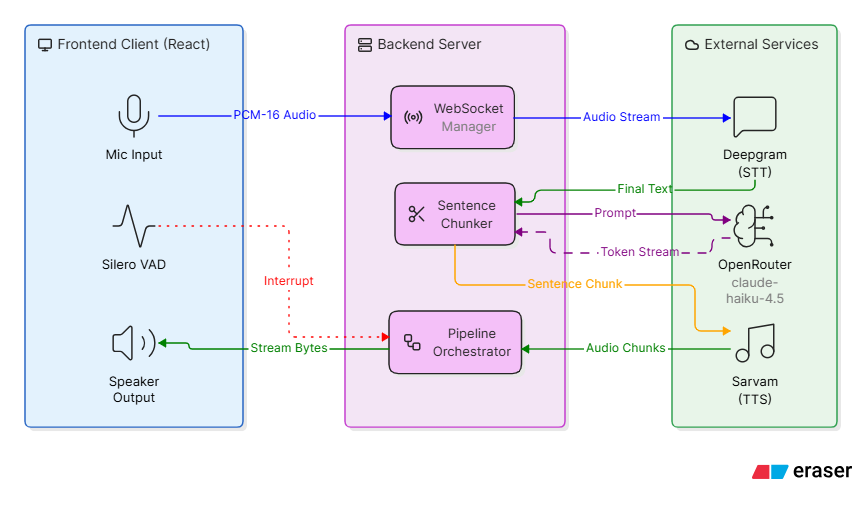

# Voice AI — Low-Latency Real-Time TTS & STT Speech Engine

This project is a high-performance, real-time voice conversational agent. It enables full-duplex voice interactions with sub-second latency by chaining **Speech-to-Text (STT)**, a **Large Language Model (LLM)**, and **Text-to-Speech (TTS)** in a concurrent streaming pipeline.
<h3 align="center">Demo [Click to Watch]</h3>

  

---

<h3 align="center">System Architecture</h3>

  

- **Pipeline Flow:** Mic → Deepgram (STT) → OpenRouter (claude-haiku-4.5) → Sarvam (TTS) → Speaker  
- **Streaming:** LLM → Server: token-by-token · Server → TTS: sentence-by-sentence · TTS → Frontend: raw audio chunks (real-time playback)

---

## Key Latency Optimization Mechanisms

### 1. Direct PCM Pipeline (Zero-Decode Overhead)
Compressing audio to MP3 or Opus introduces framing delays and CPU decompression overhead. This system uses raw **Mono Int16 PCM (LPCM)** at every boundary.
- **Microphone Input**: Captured at 16kHz, converted from Float32 to Int16 in the browser, and streamed continuously to Deepgram — no batching, no file upload.
- **TTS Output**: The backend requests the `linear16` codec from Sarvam's TTS API (raw PCM-16, no WAV container), so the base64 payload is decoded straight to bytes and forwarded to the client with nothing to strip.

### 2. Sentence-Boundary Chunking
Instead of waiting for the LLM to generate a full response, the backend splits the streaming token stream into sentences using a set of punctuation boundaries (`.!?।;:`).
- Once a sentence reaches a threshold length (>5 characters) and ends with punctuation, it is instantly pushed to the TTS processing queue.
- This overlapping pipeline executes **LLM generation and TTS synthesis concurrently**.

### 3. Client-Side Jitter Pre-Buffering
To handle network latency fluctuations without audible cuts:
- The client-side `AudioPlayer` queues incoming audio chunks.
- Playback is held until **4 chunks** (~300-400ms) are fully loaded. This absorbs initial network jitter and ensures a continuous audio stream.

### 4. Sample-Accurate Look-Ahead Scheduling
Browsers cannot play separate audio nodes back-to-back without gap pops if scheduled on simple event handlers.
- The player schedules each `AudioBufferSourceNode` precisely on the `AudioContext` timeline using `nextStartTime`.
- A **50ms look-ahead buffer** prevents the audio clock from falling behind the system clock, achieving seamless, gapless playback.

### 5. Instant Barge-in (Interrupt Handling)
True conversation requires the ability to interrupt the AI. There are no buttons for this — it's always-on.
- A local Silero VAD model (`@ricky0123/vad-web`, running in-browser) watches the mic continuously. It has one job: detect the user speaking over the AI, instantly.
- When that happens while the AI is speaking, the client sends an `interrupt` control frame.
- The server instantly cancels the active pipeline task (LLM/TTS operations) and reconnects Deepgram fresh so stale partial transcripts don't leak into the new turn.
- The client-side player immediately stops all active audio nodes, resetting the system to a clean listening state.
- End-of-turn detection is a *separate* concern handled entirely server-side by Deepgram's semantic endpointing (see below) — the client VAD never decides when you've finished talking, only whether you've started talking over the AI.
