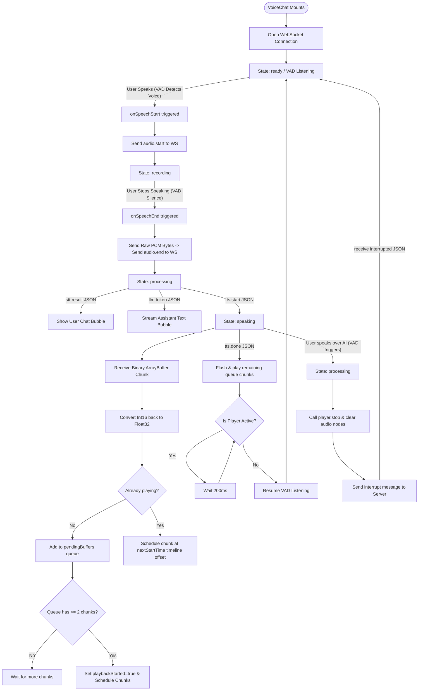

# Frontend Voice Pipeline — Code & Lifecycle Explanation

This document explains exactly how the client-side voice application operates. It breaks down the lifecycle of events, the recording pipeline, the playback engine, and the interruption mechanism, accompanied by an interactive flowchart.

---

## 1. Frontend Lifecycle & Data Flow

Below is the complete flow of states, user gestures, and background tasks on the client:



---

## 2. The WebSocket Connection & Message Router

When the client connects, it sets the WebSocket connection to handle raw binary bytes (`ws.binaryType = "arraybuffer"`). The **[VoiceChat](file:///c:/Users/Lenovo/Documents/Projects/tts-speech-engine/client/src/components/VoiceChat.jsx)** controller handles incoming data dynamically using two routes:

### A. Raw Audio Streams (Binary)
If the incoming packet is an `ArrayBuffer`, it represents a chunk of voice response. It is immediately forwarded to the playback engine:
```javascript
playerRef.current.playChunk(event.data);
```

### B. Command Packets (JSON Strings)
If the packet is text, the controller parses it to update the application state:
1.  `"type": "processing"`: Moves the interface to a loading/thinking state.
2.  `"type": "stt.result"`: Receives what the user said and renders a user chat bubble.
3.  `"type": "llm.token"`: Appends the streaming tokens from Gemini to the screen in real-time.
4.  `"type": "tts.start"`: Swaps the state to `speaking`. It stops any residual audio nodes and configures the player's sample rate to match the incoming voice stream.
5.  `"type": "tts.done"`: Signals that no more audio packages are coming. The client plays back any remaining buffered chunks and polls the player. Once the player becomes inactive, it returns the interface status to `ready`.
6.  `"type": "interrupted"`: Resets the state back to `ready` and clears any partial response buffers.

---

## 3. The Voice Activity Detection (VAD) Pipeline

Instead of relying on manual "Push-to-Talk" buttons, the system uses **[VADManager](file:///c:/Users/Lenovo/Documents/Projects/tts-speech-engine/client/src/utils/vadManager.js)** to provide a completely hands-free, conversational experience. It wraps `@ricky0123/vad-web`, which runs the **Silero VAD ONNX model** locally in the browser via WebAssembly for ~1ms speech detection latency.

1.  **Acoustic Echo Cancellation (AEC)**: The microphone stream is explicitly requested with hardware constraints (`echoCancellation: true`, `noiseSuppression: true`, `autoGainControl: true`) to prevent the speaker output from feeding back into the microphone.
2.  **Detection Thresholds**: The VAD uses a positive confidence threshold (`0.6`) to trigger speech start and a negative threshold (`0.35`) to trigger speech end. It pads the audio slightly before and after detection to ensure words aren't clipped.
3.  **Barge-In (Full-Duplex)**: Because the VAD continues to monitor the microphone even while the AI is speaking, if the user starts speaking over the AI, the VAD instantly fires `onSpeechStart`. This immediately stops the AI's playback, cancels the server's task, and routes the new user audio to the pipeline.
4.  **Format Conversion**: When the VAD fires `onSpeechEnd`, it yields a complete utterance as a Float32Array at 16kHz. We instantly convert this to PCM-16 Int16 format and send it as a binary frame over the WebSocket to the backend.

---

## 4. The Gapless Playback Engine

To stream voice segments dynamically over a network without popping, clicks, or pauses, **[AudioPlayer](file:///c:/Users/Lenovo/Documents/Projects/tts-speech-engine/client/src/utils/audioPlayer.js)** implements three mechanisms:

### A. Decode-Free Playback
To avoid decompression overhead, the player takes raw binary arrays, casts them back to `Int16Array`, and scales them back into Float32 values:
```javascript
const int16 = new Int16Array(pcm16Buf);
const float32 = new Float32Array(int16.length);
for (let i = 0; i < int16.length; i++) {
  float32[i] = int16[i] / 32768.0; // Scaled back to browser-native floats
}
```
An `AudioBuffer` is then built instantly from this array and the specified sample rate.

### B. Pre-Buffering (Absorbing Network Jitter)
If a chunk plays the instant it is downloaded, small delays in the network will cause stuttering. The player delays starting playback until it has accumulated at least `MIN_BUFFER_CHUNKS = 2` chunks.
*   Once the queue holds 2 chunks, it sets `playbackStarted = true` and schedules them.
*   If the audio ends before reaching 2 chunks, `tts.done` triggers `flushAndPlay()`, forcing immediate playback.

### C. Timeline Look-Ahead Scheduling
To chain chunks together perfectly without click gaps, the player uses a floating timeline marker: `nextStartTime`.

Instead of playing a chunk immediately, the player calculates exactly when the *preceding* chunk will finish playing on the hardware audio clock, and schedules the next one to begin at that exact timestamp:
```javascript
const now = this.audioContext.currentTime;

if (this.nextStartTime <= now) {
  // If starting fresh or falling behind, schedule with a 50ms look-ahead safety margin
  this.nextStartTime = now + 0.05;
}

// Play at the exact timestamp
source.start(this.nextStartTime);

// Slide the pointer forward by the duration of the scheduled chunk
this.nextStartTime += audioBuffer.duration;
```

---

## 5. The Interruption Flow

When the user starts speaking or clicks the microphone button during playback:

1.  **Local Silence**: The client immediately calls **`playerRef.current.stop()`**. This halts all active `AudioBufferSourceNode` objects instantly and clears the pending timeline queue.
2.  **Server Signal**: The client sends a `{"type": "interrupt"}` JSON message via the WebSocket.
3.  **Task Cancellation**: The server receives the interrupt, calls `pipeline_task.cancel()`, which halts the concurrent LLM and TTS tasks on the backend.
4.  **Ready State Reset**: The server responds with `{"type": "interrupted"}` confirming that processing has stopped, resetting the client status to `ready`.
