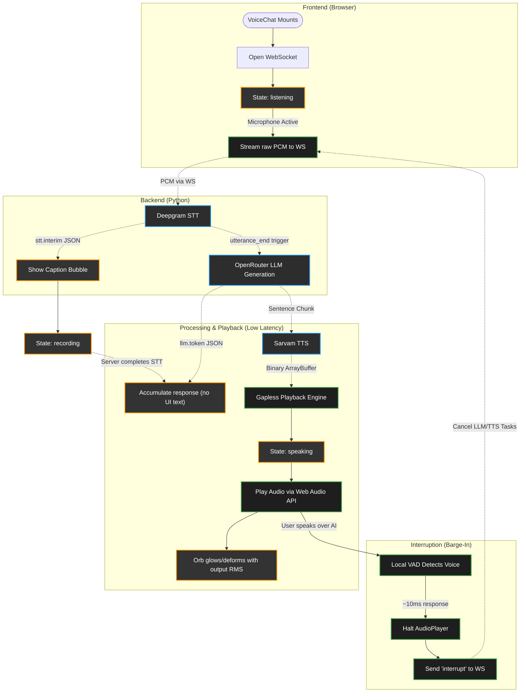

# Frontend Voice Pipeline — Code & Lifecycle Explanation

This document explains exactly how the client-side voice application operates under the **Hybrid Architecture** (Client VAD for Barge-in + Server STT for End-of-Turn).

---

## 1. Frontend Lifecycle & Data Flow

Below is the complete flow of states, user gestures, and background tasks on the client:



---

## 2. Continuous Audio Streaming

Unlike traditional push-to-talk systems that wait for you to finish speaking before uploading a file, this application uses **Continuous Streaming**.

1. **AudioWorklet**: The `vad.worklet` continuously processes microphone input at 16kHz Float32.
2. **Instant Transmission**: Every time an audio frame is processed by the worklet (`onFrameProcessed`), it is instantly converted to a PCM-16 Int16 binary array and sent over the WebSocket.
3. **No Client-Side Cutoffs**: Because audio is continuously streaming to the server, the client never "cuts you off". The server (via Deepgram) determines when you are finished speaking based on intelligent semantic endpointing, allowing for long, natural pauses without breaking the sentence.

---

## 3. The WebSocket Router

The **VoiceChat** controller handles incoming data dynamically using two routes:

### A. Raw Audio Streams (Binary)
If the incoming packet is an `ArrayBuffer`, it represents a chunk of voice response. It is immediately forwarded to the playback engine:
```javascript
playerRef.current.playChunk(event.data);
```

### B. Command Packets (JSON Strings)
If the packet is text, the controller parses it to update the application state:
1.  `"type": "stt.interim"`: Displays the live partial transcript as the caption bubble.
2.  `"type": "stt.final"`: A locked-in transcript segment (the utterance may still continue) — updates the caption.
3.  `"type": "stt.result"`: Deepgram's `UtteranceEnd` fired — clears the caption and moves the interface to `processing`.
4.  `"type": "llm.token"`: Tokens accumulate into a ref for logging/handoff, not rendered — there is no chat log in the current UI.
5.  `"type": "tts.start"`: Swaps the state to `speaking` and resets the audio player for a fresh playback session.
6.  `"type": "tts.done"`: Signals that no more audio packets are coming. Once the buffered audio actually finishes playing (polled via `AudioPlayer.isActive()`), the interface returns to `listening`.
7.  `"type": "interrupted"`: Stops any in-flight playback and clears response buffers/caption. It does **not** force the state back to `listening` — the client already flipped to `recording` the moment its own VAD detected the barge-in, and that speech is still ongoing.

Note there is no `"type": "clear_history"` or similar reset message anymore — ending a session is a client-side action (see §6 below), not a server round-trip.

---

## 4. The Voice Activity Detection (VAD) Pipeline

The system uses `@ricky0123/vad-web` running the **Silero VAD ONNX model** locally in the browser. 

In our **Hybrid Architecture**, the client-side VAD is strictly reserved for **Barge-In (Interruption)**:
1.  **Acoustic Echo Cancellation (AEC)**: Enabled so the speaker output doesn't feed back into the microphone.
2.  **Barge-In**: While the AI is speaking, if the user starts speaking, the VAD instantly fires `onSpeechStart`. This immediately stops the AI's playback, sends `"interrupt"` to the server (which cancels the pipeline task), and allows the continuous audio stream to be treated as a new user query. A ~500ms pre-speech ring buffer of recent frames is flushed to Deepgram at this moment too, so the words that triggered the barge-in aren't lost.
3.  **`onSpeechEnd` is a no-op today**: it fires but sends nothing to the server — the code comment is explicit that Deepgram must "hear" the silence itself to fire `UtteranceEnd`, so nothing else should stop the audio stream early. All end-of-turn decisions are Deepgram's alone.

---

## 5. The Gapless Playback Engine

To stream voice segments dynamically over a network without popping, clicks, or pauses, **AudioPlayer** implements three mechanisms:

### A. Decode-Free Playback
To avoid decompression overhead, the player takes raw binary arrays, casts them back to `Int16Array`, and scales them back into Float32 values.

### B. Pre-Buffering (Absorbing Network Jitter)
The player delays starting playback until it has accumulated at least `MIN_BUFFER_CHUNKS = 4` chunks (~300-400ms) to absorb network jitter.

### C. Timeline Look-Ahead Scheduling
To chain chunks together perfectly without click gaps, the player uses a floating timeline marker (`nextStartTime`) synced to the hardware audio clock (`audioContext.currentTime`), guaranteeing sample-accurate playback concatenation.

### D. AEC Bridge & Live Level Metering
All scheduled audio is routed to a `MediaStreamAudioDestinationNode` instead of straight to the speakers, and played back through a hidden `<audio>` element — this is required for Chrome's echo cancellation to actually subtract the AI's own voice from the mic input (raw `AudioBufferSourceNode` output isn't tracked by AEC). An `AnalyserNode` taps the same signal in parallel so `getLevel()` can report live RMS loudness — this is what drives the orb's reaction while the AI is speaking.

---

## 6. The Orb (`components/Orb.jsx`)

There is no chat log in the current UI. The whole surface is a single **reactive WebGL orb** (vendored from [ElevenLabs UI](https://ui.elevenlabs.io/docs/components/orb), MIT-licensed) plus a caption bubble for the live interim transcript.

*   **Rendering**: A `react-three-fiber` `<Canvas>` draws one shader-lit circle mesh. The fragment shader blends animated, noise-perturbed ovals and rings using a perlin-noise texture (served locally from `public/perlin-noise.png`) to get the organic, non-repeating motion.
*   **Volume-driven, not state-driven**: `VoiceChat` passes `volumeMode="manual"` with two callbacks, `getInputVolume` and `getOutputVolume`, which the orb polls every animation frame:
    *   `getInputVolume` returns a decaying, boosted read of the mic's RMS (fed from the VAD's `onFrameProcessed` frames) — this is what makes the orb swell while *you* talk.
    *   `getOutputVolume` returns the `AudioPlayer`'s live playback RMS (via `getLevel()`) while speaking, or a small synthetic pulse while `processing` (there's no audio to measure yet).
*   **Color by state**: `VoiceChat` maps `status` (`idle`/`listening`/`recording`/`processing`/`speaking`) to a two-stop color pair (`ORB_COLORS`), passed as the `colors` prop; the shader smoothly lerps between them, so a state change never causes a hard color cut.

## 7. Ending a Session

The corner button (previously "clear conversation") now ends the session outright: it stops any playing audio and unmounts `VoiceChat` via an `onEnd` callback from `App.jsx`, which flips the app back to the launch screen. Unmounting runs the existing effect cleanups — the WebSocket effect marks itself `closed` (so it won't auto-reconnect) and closes the socket, and the VAD effect calls `vad.destroy()`, releasing the microphone. There is no server round-trip for this; it's a purely client-side teardown.
