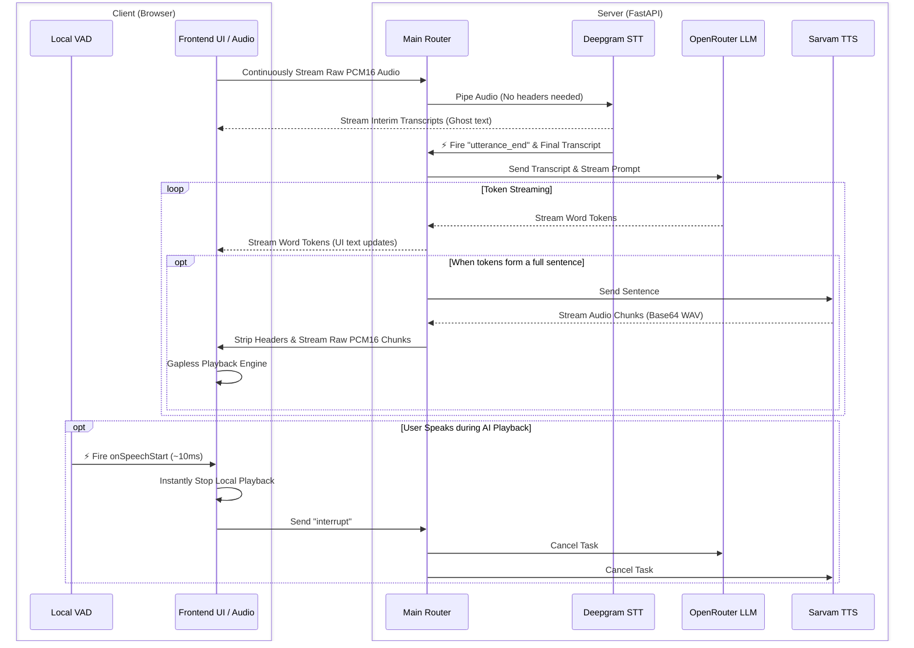
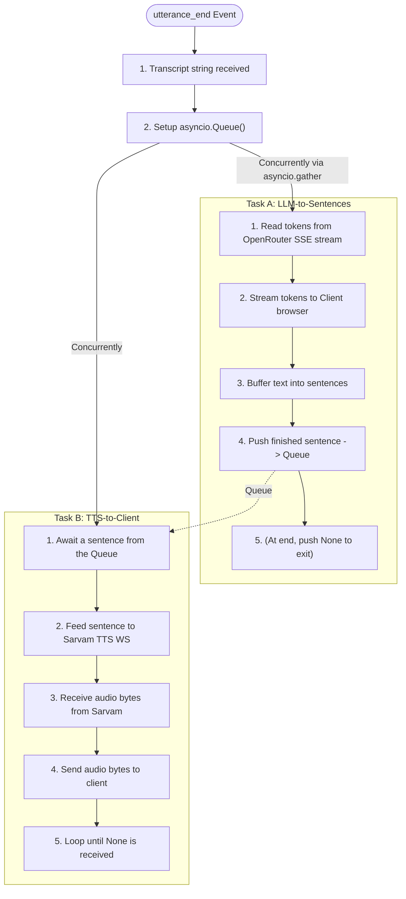

# TTS Speech Engine — System Architecture & Code Walkthrough

Welcome to the documentation for your **TTS Speech Engine**. This guide explains how the system works on a code level in simple, easy-to-understand terms. It covers how the files fit together, the lifecycle of a WebSocket connection, how the individual services function, and how the asynchronous pipeline operates in real time.

---

## 1. System Overview & File Structure

The system is a real-time, two-way conversational voice assistant. At a high level, the flow of a single user turn is:

### The Workspace Directory Structure
The workspace is organized into a client-server architecture:
*   **server/**: The FastAPI application files.
    *   **main.py**: The server entrypoint, WebSocket logic, and pipeline coordinator.
    *   **config.py**: Handles loading environment configurations (API keys, settings).
    *   **services/**: Integrations with external AI services.
        *   **stt_deepgram.py**: Speech-to-Text streaming service using Deepgram (model configurable, default `nova-3`).
        *   **llm.py**: Language model streaming service using OpenRouter — any model on their catalog (default `anthropic/claude-haiku-4.5`), streamed over SSE.
        *   **tts.py**: Text-to-Speech streaming service using Sarvam AI's WebSockets.

---

## 2. The WebSocket Lifecycle (`main.py`)

A WebSocket connection allows a continuous, two-way (full-duplex) exchange of data between the user's browser and the FastAPI server without opening new HTTP requests for every action. The lifecycle is handled by the **voice_websocket** function.

### A. Connection Establishment
When a client connects to `ws://localhost:8000/ws/voice`:
1.  The connection is accepted (`await ws.accept()`).
2.  The server sets up a clean state for the session:
    *   `conversation_history`: A list storing chat context so the LLM remembers the conversation.
    *   `session_stt`: A dedicated Deepgram WebSocket session for the client.
    *   `pipeline_task`: A placeholder for the background task running the AI pipelines.

### B. Listening for Client Messages
The server enters a continuous loop awaiting incoming messages (`await ws.receive()`). It processes three types of data:
1.  **Binary Data (Raw Audio Frame)**:
    The server forwards the incoming raw PCM byte chunks directly to the Deepgram WebSocket.
2.  **Control Messages (JSON Strings)**:
    *   `"type": "speech.start"`: Sent when the client's local VAD hears speech begin. Starts the per-turn latency clock and resets the STT transcript buffer. Informational only — Deepgram decides end-of-turn independently.
    *   `"type": "interrupt"`: Barge-in / explicit stop. Cancels the running pipeline task immediately and reconnects Deepgram so stale partial transcripts from the interrupted turn don't leak into the next one.
    *   `"type": "ping"`: Responds with `pong` to keep the connection alive.
3.  **Disconnection**:
    If the websocket disconnects, the loop breaks, the pipeline task is cancelled, and STT/TTS connections are gracefully closed.

---

## 3. How the Services Work

### A. Speech-to-Text (`stt_deepgram.py`)
Implemented in the **DeepgramStreamingSTT** class.
*   **Persistent Connection**: It maintains a persistent WebSocket connection to `wss://api.deepgram.com/v1/listen`.
*   **Audio Streaming**: Receives continuous raw PCM audio from the client and forwards it directly to Deepgram without needing to build WAV headers.
*   **Callbacks**:
    *   `on_interim`: Relays partial text to the client so the UI updates as you speak.
    *   `on_final`: Accumulates each locked-in ("is_final") segment into the running transcript.
    *   `on_utterance_end`: Deepgram uses semantic endpointing (detecting natural pauses in speech). When this fires, it triggers `run_voice_pipeline()` in `main.py` with the accumulated transcript.
*   **Fallback for a raced UtteranceEnd**: Deepgram can occasionally fire `UtteranceEnd` before the trailing segment of a turn is ever marked `is_final` (network/model timing). If the service only trusted `is_final` text, that turn would end up empty and get silently dropped — no pipeline run, no log line, the app just looks stuck. To guard against this, it also tracks `_last_seen` (the latest final-or-interim text) and falls back to it if the accumulated final transcript is empty. `UtteranceEnd` now always logs, so a stuck turn is always visible in the server log instead of vanishing.

### B. Large Language Model (`llm.py`)
Implemented in the **OpenRouterLLM** class — talks to any model on OpenRouter's catalog via its OpenAI-compatible Chat Completions API.
*   The service holds a persistent `httpx.AsyncClient` pointed at `https://openrouter.ai/api/v1`, authenticated with your API key.
*   Conversation history is kept in the OpenAI `{"role": "user"|"assistant", "content": "…"}` format (not Gemini's `{"role": ..., "parts": [...]}`), with the system prompt prepended each turn.
*   It POSTs to `/chat/completions` with `"stream": true` and reads the response as Server-Sent Events (`data: {...}` lines). Each parsed chunk's `choices[0].delta.content` is yielded as a token — same streaming shape as before, so nothing downstream (`main.py`'s sentence chunker) had to change.
*   The model is configurable via `OPENROUTER_MODEL` (default `anthropic/claude-haiku-4.5`) — swapping providers/models is a config change, not a code change.

### C. Text-to-Speech (`tts.py`)
Implemented in the **SarvamTTS** class.
*   **WebSocket Streaming**: Synthesizing speech sentence-by-sentence requires a fast, persistent pipeline. This service maintains its own WebSocket connection directly to Sarvam AI (`wss://api.sarvam.ai/text-to-speech/ws`).
*   **Configuring**: Upon connecting, it sends a JSON configuration frame specifying the speaker voice, target language, and output audio codec ("wav").
*   **Feeding Text**: An internal background task listens to incoming sentences and forwards them to Sarvam's WebSocket, immediately followed by a `{"type": "flush"}` command to trigger synthesis without delay.
*   **Stripping Headers**: Sarvam returns base64-encoded WAV segments. The custom **`_strip_wav_header`** helper extracts only the raw PCM-16 audio samples, yielding clean gapless audio chunks to the client.

---

## 4. The Magic: Asynchronous Task Cycle & Concurrency

The voice pipeline is coordinated by the **run_voice_pipeline** function. It is designed to be highly responsive: the user should hear the voice assistant begin speaking the first sentence while the assistant is still generating the rest of the response.

Here is how the asynchronous task cycle accomplishes this:

### 1. The Async Queue (`asyncio.Queue`)
To run speech generation and text generation at the same time, we need a way to pass data between them safely. We use an **`asyncio.Queue`**. Think of the queue as a pipe:
*   **Task A (Producer)** pushes completed sentences into the pipe.
*   **Task B (Consumer)** waits at the other end, takes sentences out as soon as they appear, and converts them to speech.

By calling **`await asyncio.gather(_llm_to_sentences(), _tts_to_client())`**, both loops run concurrently on a single CPU thread, handing off control to each other whenever they perform I/O actions (like waiting for API networks or queue items).

### Handling Interruption (Barge-In)
Because the pipeline runs inside a background task (`pipeline_task`), the main WebSocket loop is never blocked.

If the client sends `"interrupt"` (meaning the user's local VAD detected them barging in over the AI), the server instantly calls `pipeline_task.cancel()`, which halts the concurrent LLM and TTS loops, then reconnects Deepgram fresh so stale partial transcripts from the cancelled turn don't bleed into the new one.
