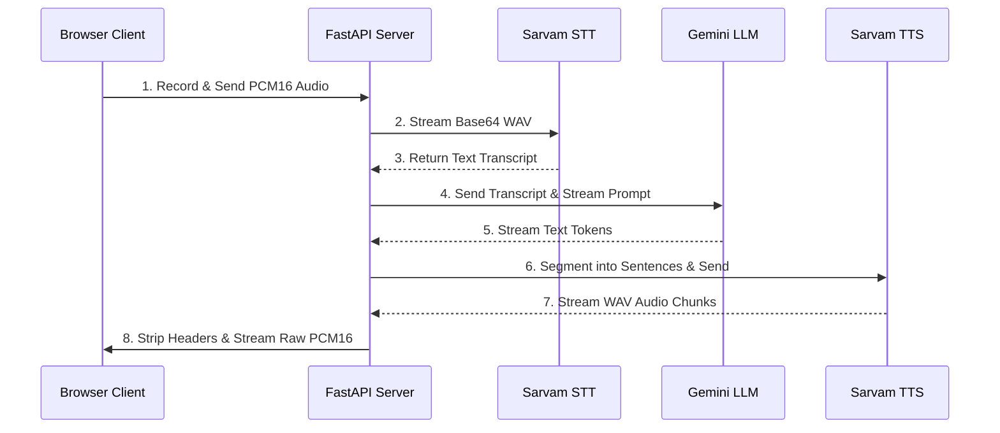
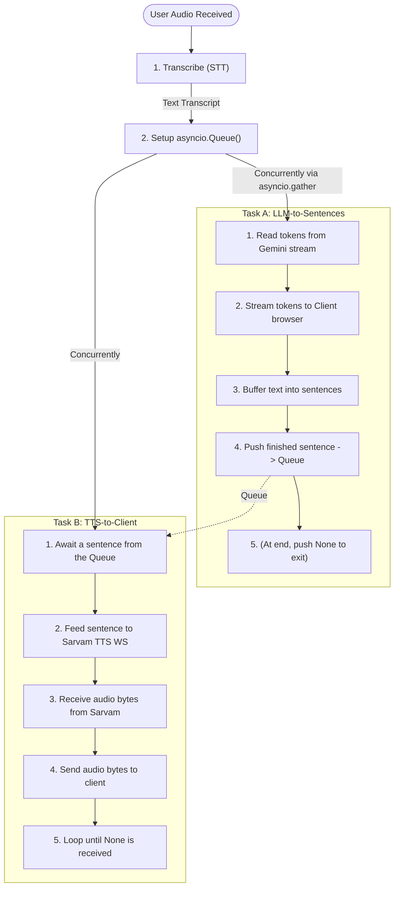

# TTS Speech Engine — System Architecture & Code Walkthrough

Welcome to the documentation for your **TTS Speech Engine**. This guide explains how the system works on a code level in simple, easy-to-understand terms. It covers how the files fit together, the lifecycle of a WebSocket connection, how the individual services function, and how the asynchronous pipeline operates in real time.

---

## 1. System Overview & File Structure

The system is a real-time, two-way conversational voice assistant. At a high level, the flow of a single user turn is:

### The Workspace Directory Structure
The workspace is organized into a client-server architecture:
*   **[server/](file:///c:/Users/Lenovo/Documents/Projects/tts-speech-engine/server/)**: The FastAPI application files.
    *   **[main.py](file:///c:/Users/Lenovo/Documents/Projects/tts-speech-engine/server/main.py)**: The server entrypoint, WebSocket logic, and pipeline coordinator.
    *   **[config.py](file:///c:/Users/Lenovo/Documents/Projects/tts-speech-engine/server/config.py)**: Handles loading environment configurations (API keys, settings).
    *   **[utils.py](file:///c:/Users/Lenovo/Documents/Projects/tts-speech-engine/server/utils.py)**: Helper utilities for file conversion.
    *   **[services/](file:///c:/Users/Lenovo/Documents/Projects/tts-speech-engine/server/services/)**: Integrations with external AI services.
        *   **[stt.py](file:///c:/Users/Lenovo/Documents/Projects/tts-speech-engine/server/services/stt.py)**: Speech-to-Text service using Sarvam AI.
        *   **[llm.py](file:///c:/Users/Lenovo/Documents/Projects/tts-speech-engine/server/services/llm.py)**: Language model streaming service using Google Gemini.
        *   **[tts.py](file:///c:/Users/Lenovo/Documents/Projects/tts-speech-engine/server/services/tts.py)**: Text-to-Speech streaming service using Sarvam AI's WebSockets.

---

## 2. The WebSocket Lifecycle (`main.py`)

A WebSocket connection allows a continuous, two-way (full-duplex) exchange of data between the user's browser and the FastAPI server without opening new HTTP requests for every action. The lifecycle is handled by the **[voice_websocket](file:///c:/Users/Lenovo/Documents/Projects/tts-speech-engine/server/main.py#L175)** function.

### A. Connection Establishment
When a client connects to `ws://localhost:8000/ws/voice`:
1.  The connection is accepted (`await ws.accept()`).
2.  The server sets up a clean state for the session:
    *   `conversation_history`: A list storing chat context so Gemini remembers the conversation.
    *   `audio_buffer`: A byte buffer to collect the raw incoming audio chunks from the client.
    *   `is_recording`: A boolean flag indicating if the user is currently speaking.
    *   `pipeline_task`: A placeholder for the background task running the AI pipelines.

### B. Listening for Client Messages
The server enters a continuous loop awaiting incoming messages (`await ws.receive()`). It processes three types of data:
1.  **Binary Data (Raw Audio Frame)**:
    If `is_recording` is `True`, the server appends the incoming byte chunk directly to `audio_buffer`.
2.  **Control Messages (JSON Strings)**:
    *   `"type": "audio.start"`: Resets the audio buffer, updates the browser's recording sample rate (e.g., 48kHz), and sets `is_recording = True`.
    *   `"type": "audio.end"`: Stops recording (`is_recording = False`). If the buffer has data, the server:
        *   Cancels any currently running pipeline task (to avoid overlapping responses if the user speaks again).
        *   Spawns a new background task to run the voice pipeline using **`asyncio.create_task(run_voice_pipeline(...))`**.
    *   `"type": "interrupt"`: Triggered if the user clicks "stop" or starts speaking while the AI is still playing audio. This cancels the running pipeline task immediately.
    *   `"type": "clear_history"`: Resets `conversation_history`.
    *   `"type": "ping"`: Responds with `pong` to keep the connection alive.
3.  **Disconnection**:
    If the websocket disconnects, the loop breaks, the pipeline task is cancelled, and cleanup occurs.

---

## 3. How the Services Work

### A. Speech-to-Text (`stt.py` & `utils.py`)
Implemented in the **[SarvamStreamingSTT](file:///c:/Users/Lenovo/Documents/Projects/tts-speech-engine/server/services/stt.py)** class.
*   **The Problem**: Web browsers capture audio as raw PCM format. However, Sarvam's Speech-to-Text streaming SDK expects a valid file container, like a WAV file encoded in base64.
*   **The Solution**: When transcribe is called, the server uses **`_pcm_to_wav_base64`** to manually build and prepend a standard 44-byte WAV header containing sample rate, bit depth, and channel information to the raw audio bytes.
*   **WebSocket Streaming**: The base64 WAV payload is streamed directly to Sarvam via the `AsyncSarvamAI` SDK WebSocket connection (`speech_to_text_streaming.connect`), which instantly returns the transcript text object.

### B. Large Language Model (`llm.py`)
Implemented in the **[GeminiLLM](file:///c:/Users/Lenovo/Documents/Projects/tts-speech-engine/server/services/llm.py#L15)** class.
*   The service configures the Google Generative AI SDK using your API key.
*   When a prompt is sent, it appends it to the `conversation_history` list.
*   It calls **`generate_content_async(messages, stream=True)`**. Because `stream=True` is enabled, Google returns the text in small tokens (parts of words) as they are generated, rather than making the server wait for the entire paragraph to finish.

### C. Text-to-Speech (`tts.py`)
Implemented in the **[SarvamTTS](file:///c:/Users/Lenovo/Documents/Projects/tts-speech-engine/server/services/tts.py#L62)** class.
*   **WebSocket Streaming**: Synthesizing speech sentence-by-sentence requires a fast, persistent pipeline. This service maintains its own WebSocket connection directly to Sarvam AI (`wss://api.sarvam.ai/text-to-speech/ws`).
*   **Configuring**: Upon connecting, it sends a JSON configuration frame specifying the speaker voice, target language, and output audio codec ("wav").
*   **Feeding Text**: An internal background task listens to incoming sentences and forwards them to Sarvam's WebSocket, immediately followed by a `{"type": "flush"}` command to trigger synthesis without delay.
*   **Stripping Headers**: Sarvam returns base64-encoded WAV segments. If we played WAV files directly, the audio would sound glitched due to repeated headers. The custom **`_strip_wav_header`** helper parses the bytes, finds the `"data"` chunk marker, and extracts only the raw PCM-16 audio samples, yielding clean audio chunks to the client.

---

## 4. The Magic: Asynchronous Task Cycle & Concurrency

The voice pipeline is coordinated by the **[run_voice_pipeline](file:///c:/Users/Lenovo/Documents/Projects/tts-speech-engine/server/main.py#L61)** function. It is designed to be highly responsive: the user should hear the voice assistant begin speaking the first sentence while the assistant is still generating the rest of the response.

Here is how the asynchronous task cycle accomplishes this:

### 1. The Async Queue (`asyncio.Queue`)
To run speech generation and text generation at the same time, we need a way to pass data between them safely. We use an **`asyncio.Queue`**. Think of the queue as a pipe:
*   **Task A (Producer)** pushes completed sentences into the pipe.
*   **Task B (Consumer)** waits at the other end, takes sentences out as soon as they appear, and converts them to speech.

### 2. Task A: `_llm_to_sentences` (The Producer)
This task runs the LLM generation loop:
1.  It streams word tokens from the Gemini service.
2.  It sends each individual token to the browser client immediately (`llm.token`) so the client can display the text dynamically on screen.
3.  It accumulates the tokens in a temporary string. If it detects a sentence-boundary character (like `. ! ? । ; :`) and the sentence has more than 5 characters, it pushes that sentence to the `sentence_queue`.
4.  Once Gemini is done, it flushes any remaining text, appends the turns to the `conversation_history`, and pushes a special `None` marker to the queue (signaling Task B that it is finished).

### 3. Task B: `_tts_to_client` (The Consumer)
This task runs the Text-to-Speech loop:
1.  It uses an async generator to drain the queue. It blocks (suspends execution) when the queue is empty, and automatically wakes up when a new sentence is pushed by Task A.
2.  It sends the dequeued sentence to the `SarvamTTS` WebSocket connection.
3.  As audio bytes are synthesized by Sarvam, it streams the raw PCM bytes directly down the WebSocket to the client.
4.  If it reads the `None` marker, it knows synthesis is complete, closes the TTS websocket, and ends.

By calling **`await asyncio.gather(_llm_to_sentences(), _tts_to_client())`**, both loops run concurrently on a single CPU thread, handing off control to each other whenever they perform I/O actions (like waiting for API networks or queue items).

### 4. Handling Interruption
Because the pipeline runs inside a background task (`pipeline_task`), the main WebSocket loop is never blocked. 

If the client sends an `"interrupt"` or starts speaking again:
1.  The main loop executes `pipeline_task.cancel()`.
2.  This cancels the ongoing `asyncio.gather` tasks.
3.  The TTS websocket is cleanly shut down in the `finally` block, and the audio stream halts instantly.
4.  The server is immediately ready to accept new voice inputs.
